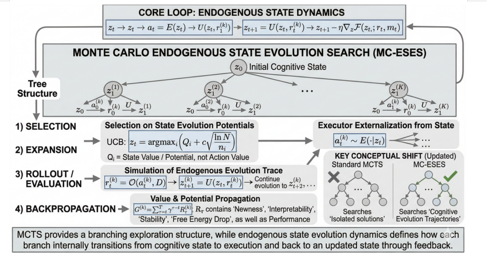
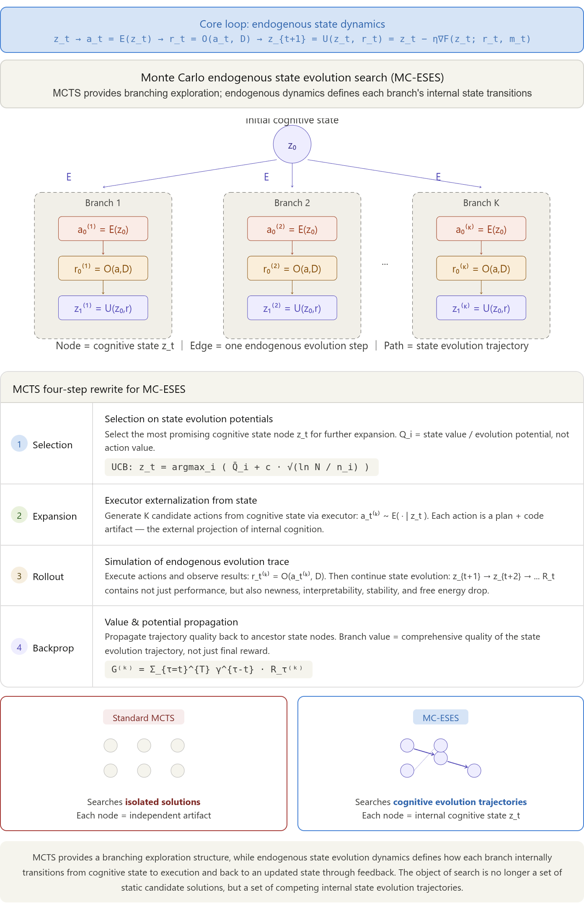
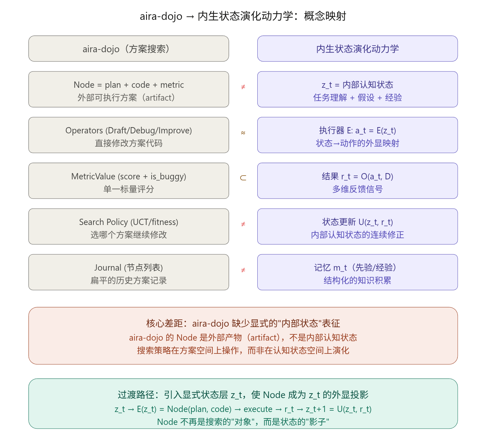
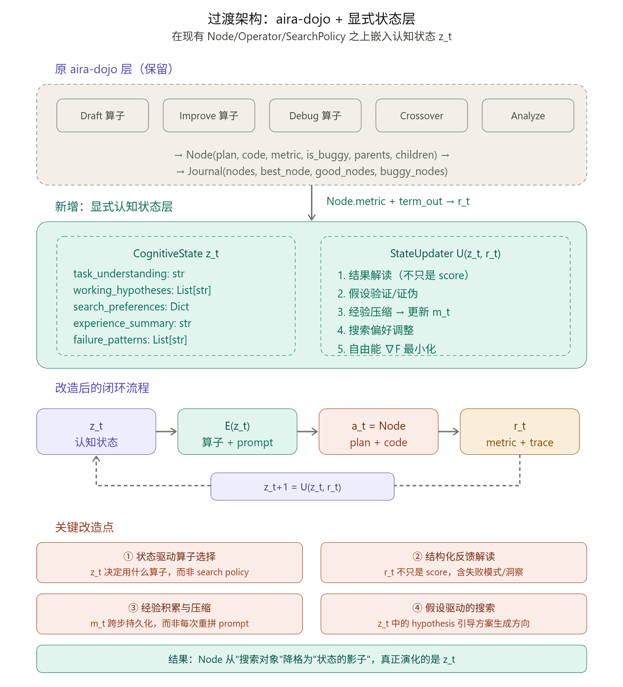

---
Let我先看一下这篇论文的内容，然后帮你分析从 aira-dojo 到内生认知状态演化动力学的过渡路径。好的，现在我对两个系统都有了完整的理解。你的问题非常精准——让我来做一个系统性的映射分析和过渡路径规划。

## 首先回答你的第一个问题

是的，在 aira-dojo 中，**一个 Node 就是一个完整的解方案**，包含 `plan`（自然语言思路）+ `code`（完整 Python 代码）+ `metric`（执行后评分）。但这恰恰是它与内生状态演化框架的**根本差异点**所在。

先来看两个系统的精确映射关系：


## 核心诊断：aira-dojo 的"缺失层"

你的直觉是对的——aira-dojo 中一个 Node 确实是 `plan + code + metric`，但这正是它和内生状态演化框架之间的关键断裂。让我精确地说明差异所在。

在 aira-dojo 中，搜索策略直接操作的是**方案本身**：选一个 Node，用 Improve/Debug 算子修改它的 code，得到一个新 Node。整个过程是 `Node_t → Operator → Node_t+1`。这里没有一个独立的"认知状态"存在——LLM 每次被调用时，它的"理解"完全由 prompt 中塞入的上下文（父节点代码、错误日志、sibling 方案）临时拼装而成，用完即弃。

而内生状态演化框架要求的是：存在一个**持久的、可更新的内部状态 `z_t`**，它编码了"我目前怎么理解这个任务"、"我试过什么、学到了什么"、"我倾向于什么方向"。方案代码只是 `z_t` 的外显投影 `a_t = E(z_t)`，不是搜索的对象本身。

用一句话概括这个差距：**aira-dojo 的"状态"分散在 prompt 拼接逻辑中，是隐式的、无结构的、不可积累的。**

下面来看具体的过渡方案：


## 具体过渡路径：四步改造

我按照从易到难、可以逐步实施的顺序来说明：

### 第一步：引入显式的 `CognitiveState` 对象

这是最关键的一步。在现有的 `journal.py` 旁边创建一个新的状态结构，不再让"系统对任务的理解"隐含在 prompt 拼装中。你可以这样定义：

```python
class CognitiveState:
    task_understanding: str       # 当前对任务的结构化理解
    working_hypotheses: List[str] # 当前活跃的工作假设
    search_preferences: Dict      # 倾向什么方向（如"特征工程"vs"模型换代"）
    experience_summary: str       # 从历史尝试中压缩的经验
    failure_patterns: List[str]   # 已识别的失败模式
    confidence_map: Dict[str, float]  # 对各方向的信心估计
```

这个对象就是 `z_t`。它独立于任何一个 Node 存在——Node 是 `z_t` 的外显投射，而 `z_t` 才是被持续维护和演化的东西。

### 第二步：改造 Operator 调用为"状态→外显"映射

当前 aira-dojo 的 Improve 算子本质是 `Improve(parent_node.code, parent_node.metric) → new_code`。改造后应该是 `E(z_t) → (operator_choice, enriched_prompt) → new_node`。

具体来说，状态 `z_t` 同时决定两件事：用什么算子（Draft/Improve/Crossover），以及 prompt 中携带什么上下文。这取代了原来 search_policy 中硬编码的选择逻辑。比如，如果 `z_t.failure_patterns` 中反复出现"列名不匹配"，系统就不应该继续 Debug 这条死路，而应该 Draft 一个全新方案——这个判断来自状态本身，而非随机选择。

### 第三步：用 LLM 实现结构化的状态更新函数 `U(z_t, r_t)`

这是 aira-dojo 完全没有的部分。当前系统执行完代码后，只提取一个 `MetricValue`，然后 Journal 记录一下就结束了。你需要增加一个"反思"步骤：

```
反馈 r_t 不只是 metric.value，还包括：
- term_out 中的错误模式分析
- 与之前尝试的 metric 对比（进步/退步/停滞）
- 代码的哪些部分有效、哪些无效

U(z_t, r_t) 通过一次 LLM 调用来完成：
- 输入：当前 z_t + 本轮 r_t 的结构化摘要
- 输出：更新后的 z_t+1（修正后的假设、新的经验、调整后的搜索偏好）
```

这就是文档中说的自由能下降 `z_t+1 = z_t - η∇F(z_t; r_t, m_t)`——用自然语言近似实现。

### 第四步：将 MCTS 的节点从 Node 切换为 CognitiveState

当前 MCTS 中 `MCTSNode extends Node`，树节点就是方案。改造后，树节点应该是 `CognitiveState`：

```
当前：MCTS Tree 的节点 = MCTSNode(code, metric, N, Q)
改造：MCTS Tree 的节点 = CognitiveStateNode(z_t, N, Q)
      展开 = 从 z_t 生成多个候选外显动作 a_t^(k)
      模拟 = 执行 a_t^(k)，得到 r_t^(k)
      回传 = 按 r_t^(k) 更新祖先的 Q 值
      关键区别 = 同一个 z_t 可以产出不同风格的方案
```

这样搜索的对象就从"方案序列"提升为"认知状态演化轨迹"，和你的理论框架完全对齐。

## 实施建议

从实操角度看，我建议分两个阶段走：

**阶段 A（最小改动验证）**：先只做第一步和第三步——在现有 Greedy/MCTS 外面包一层 `CognitiveState`，每轮多一次"反思 LLM 调用"来更新状态，然后用状态去 enrich 下一轮的 operator prompt。这样代码改动最小，可以在 AIRS-bench 上直接跑对比实验，看"有无显式状态"的效果差异。

**阶段 B（完整重构）**：如果阶段 A 验证了状态层的价值，再做第二步和第四步——把搜索策略的节点类型彻底替换，让 MCTS/Evolutionary 在认知状态空间上搜索。这对应论文中可以命名为 **ESETS（Endogenous State Evolution Tree Search）** 的完整方法。

核心原则始终是：**让 Node 从"被搜索的对象"变成"状态的副产品"**。aira-dojo 的工程基础设施（算子、执行器、Journal、MCTS 骨架）都可以保留复用，真正需要新增的只是那个持久化的认知状态层和驱动它演化的更新函数。